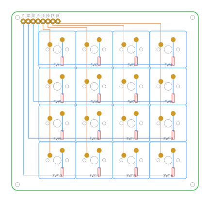
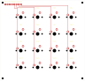
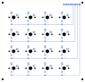

# Makropad 4 × 4

16 Tasten im 19,05-mm-Raster, Cherry MX, gesteuert von einem Pro Micro über
acht Lötpunkte. Platine **96,2 × 92,2 mm**, zwei Lagen, vollständig verdrahtet.



Entwurf, Fertigungsdaten und Firmware liegen hier zusammen. Die Platine ist
nicht von Hand gezeichnet, sondern wird aus einem Skript erzeugt — Rastermaß
und Tastenzahl sind dadurch eine Zahl im Kopf der Datei.

## Anschlüsse

Acht durchkontaktierte Lötpunkte in einer Reihe am oberen Rand, im
2,54-mm-Raster. Von links:

```
R3  R2  R1  R0  C0  C1  C2  C3
```

| Lötpunkt | QMK | Aufdruck am Pro Micro | Arduino |
|---|---|---|---|
| `R0` | `D4` | 4 | 4 |
| `R1` | `C6` | 5 | 5 |
| `R2` | `D7` | 6 | 6 |
| `R3` | `E6` | 7 | 7 |
| `C0` | `F4` | A3 | 21 |
| `C1` | `F5` | A2 | 20 |
| `C2` | `F6` | A1 | 19 |
| `C3` | `F7` | A0 | 18 |

Zeilen auf der linken Stiftleiste, Spalten auf der rechten, beide in der
unteren Hälfte des Moduls — so bleiben die Drähte kurz.

**Frei bleiben** `D0`/`D1` (I²C, für ein Display), `D2`/`D3` (seriell),
`B1`/`B2`/`B3` (SPI) sowie `B4`/`B5`/`B6`. Versorgung braucht die Platine
keine: Eine Tastenmatrix wird allein über die acht Signalleitungen abgefragt.

## Verdrahtung

```
Spalte ──── Schalter ──── Diode ──►── Zeile
                          Anode   Kathode
```

Die Diode verhindert Phantomtasten: Ohne sie schließen drei gleichzeitig
gedrückte Tasten einen Pfad über eine vierte, die gar nicht gedrückt ist.
Stromrichtung Spalte → Zeile, in QMK `COL2ROW`.

Spalten laufen senkrecht auf der Vorderseite, Zeilen waagerecht auf der
Rückseite. Weil jeder Lötpunkt auf der Achse seiner Bahn sitzt, kreuzt sich
nichts — die Platine kommt ohne eine einzige Durchkontaktierung aus.

| Vorderseite | Rückseite |
|---|---|
|  |  |

## Fertigen lassen

`hardware/keypad4x4-gerber.zip` bei einem Hersteller hochladen, nicht
entpacken. Voreinstellungen passen: zweilagig, 1,6 mm, HASL.

Geprüft ist die Platine mit dem Regelprüfer von KiCad 10:

```
Regelverstöße:        0
Unverbundene Stellen: 0
```

Dazu gegengelesen: Jedes der 40 Lötaugen hat eine durchkontaktierte Bohrung,
alle 52 Löcher ohne Kupfer sind vorhanden, 92 Bohrungen gesamt. Das Rastermaß
beträgt überall exakt 19,05 mm — auch von Zapfenloch zu Zapfenloch.

Wer die Dioden bestücken lassen will, findet in `bestueckung/` die Stückliste
und die Positionsdatei. Die 16 SOD-123 sitzen auf der **Unterseite**.

## Stückliste

| Menge | Teil | Hinweis |
|---|---|---|
| 16 | Cherry MX oder kompatibel | **PCB-Bauform mit fünf Beinen** |
| 16 | 1N4148W, SOD-123 | Rückseite, SMD |
| 1 | Pro Micro ATmega32U4 | oder steckkompatibler Ersatz |
| 1 | Stiftleiste 8-polig, 2,54 mm | |
| 4 | M2-Schraube mit Abstandshalter | Löcher Ø 2,2 mm |

Die Schalter brauchen die PCB-montierte Bauform mit zwei Kunststoffzapfen
neben den Kontakten — die Platine hat Löcher dafür. Die Plattenbauform ohne
Zapfen passt zwar hinein, sitzt aber lose.

## Firmware

`firmware/keypad4x4/` nach `keyboards/` in QMK oder vial-qmk kopieren, dann:

```
make keypad4x4:default          # feste Belegung
make keypad4x4:vial             # zur Laufzeit änderbar
```

Beide Fassungen sind übersetzt und geprüft:

| | Größe | Auslastung |
|---|---|---|
| default | 15.826 Bytes | 55 % |
| vial | 28.212 Bytes | 98 % |

Die Vial-Fassung passt nur knapp: Der Pro Micro hat nach Abzug des
Bootloaders 28.672 Bytes, und Vial bringt viel mit. In
`keymaps/vial/rules.mk` ist deshalb alles Entbehrliche abgeschaltet und die
Zahl der Ebenen auf drei begrenzt. **Für Erweiterungen ist kein Platz mehr.**
Wer mehr will, nimmt ein RP2040-Modul in Pro-Micro-Bauform — es passt auf
dieselben Lötpunkte und hat das Sechzehnfache an Speicher.

### Belegung

Grundebene ein Zifferblock, die gedrückt gehaltene Taste unten rechts bringt
`F13` bis `F24` und die Lautstärke.

```
7  8  9  /            F13 F14 F15 F16
4  5  6  *            F17 F18 F19 F20
1  2  3  −            F21 F22 F23 F24
0  .  ⏎  Fn           🔇  🔉  🔊  —
```

`F13` bis `F24` gibt es auf keiner gewöhnlichen Tastatur, und genau deshalb
sind sie brauchbar: Kein Programm belegt sie schon. Werkzeuge wie Hammerspoon
oder die Kurzbefehle-App können sie frei binden.

## Ändern

```bash
cd hardware && python3 generate_pcb.py && python3 preview.py
```

Oben in `generate_pcb.py` stehen `COLS`, `ROWS` und `PITCH`. Auf 5 × 4 oder
ein engeres Raster umzustellen ist eine Zeile — Platinengröße,
Bauteilpositionen und alle Leiterbahnen werden daraus gerechnet.

`preview.py` liest dabei die **erzeugte Platinendatei**, nicht die Absicht des
Generators. Ein Schreibfehler fällt dadurch im Bild auf, statt unbemerkt zu
bleiben. `gerber_render.py` geht noch einen Schritt weiter und zeichnet die
ausgelieferten Gerber- und Bohrdateien selbst — also das, was beim Hersteller
ankommt.

## Werkzeuge

KiCad 10 zum Ansehen und Bearbeiten, Python 3 für die Skripte, QMK oder
vial-qmk für die Firmware. Die Fußabdrücke stehen vollständig in der
Platinendatei, sie braucht also keine Bibliothek.
